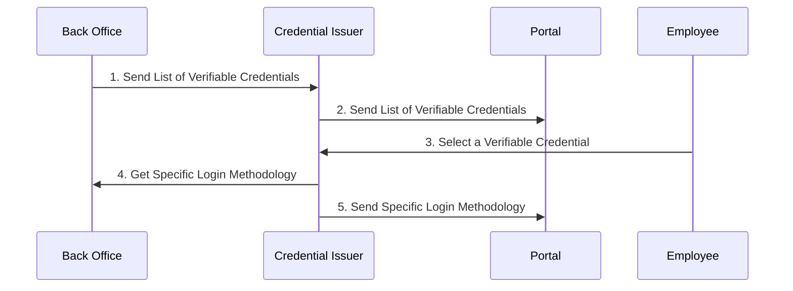
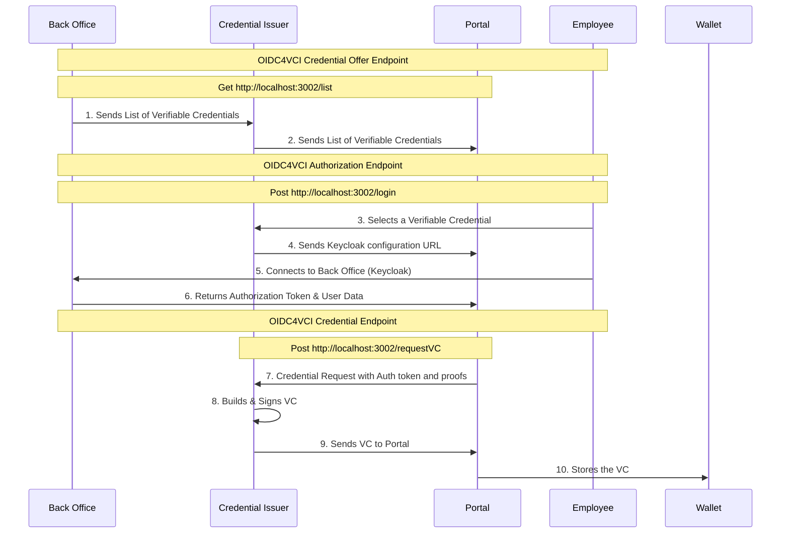

# **Project presentation** 

The Issuance Credential Protocol is a project which responds to the following needs : 
			- Build a standardized Credential Issuer in accordance with the OIDC4VCI and OIDC4VP latest protocols. It generate and signs VC, manage user's demand through the Portal and back offices.
			- Build a standardized user Portal.
			- Build a standardized getway solution between the ICP and the different backoffices which  need the SSI solution provided by Gaia-X.

# **OIDC4VCI main workflow**

The latest  [OIDC4VCI ](https://openid.net/specs/openid-4-verifiable-credential-issuance-1_0.html) specifications clarify the following endpoints : 
		- [The Credential Offer endpoint](https://openid.net/specs/openid-4-verifiable-credential-issuance-1_0.html#name-credential-offer-endpoint) : This endpoint is responsible for sending the available Verifiable Credentials to the user. We use our Credential Issuer Component to manage this route and logic.
		- [The authorization endpoint](https://openid.net/specs/openid-4-verifiable-credential-issuance-1_0.html#name-authorization-endpoint) : This endpoint verifies the user and sends back the authorisation token. (This route will also include the [token endpoint](https://openid.net/specs/openid-4-verifiable-credential-issuance-1_0.html#name-token-endpoint) in our use case)
		- The [Credential Endpoint](https://openid.net/specs/openid-4-verifiable-credential-issuance-1_0.html#name-credential-endpoint) which accepts the authorization token and proofs to build the VC and sends it back to the user. We use our Credential Issuer Component to manage this route and logic.

# **Employee credentials workflow** 

At this stage we consider the following points : 
		- The Credential Issuer is aware of the Verifiable Credentials list as well as all login methodologies. These data are stored in memory with a regular update from the different back offices.

**Classical authentication**

We consider classical authentication in the case of an Employee initial VC offering. The Employee needs to connect to the back office specific workflow (in this case we consider Keycloak).
A successful backoffice connection will return an authorization token to the ICP. This token as well as the user data returned by the back office uppon login will let the ICP build and sign the VC and send it to the user.

